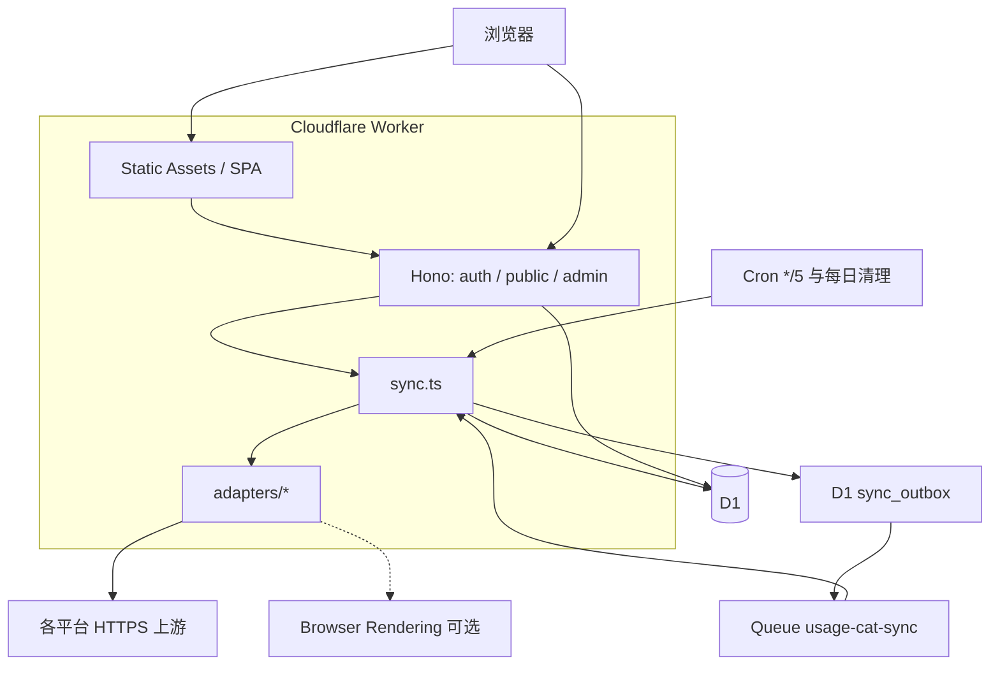

# 架构说明

Usage Cat 是单 Worker 应用：Hono 提供 API，React SPA 作为 Assets，D1 存状态，Queue 跑同步，Cron 负责调度和清理。

## 运行时怎么拆

| 层 | 位置 | 职责 |
| --- | --- | --- |
| 页面 | `src/routes/*`、`src/components/*` | 公开看板、详情图、登录、后台。TanStack Router + Query，React 19 |
| 共享契约 | `src/shared/usage.ts` | 平台 ID、Zod schema、指标与快照形状。前后端共用 |
| HTTP | `src/worker/index.ts` | 安全头、Origin 校验、路由挂载、Cron / Queue 导出 |
| 鉴权 | `src/worker/auth.ts` | GitHub OAuth PKCE、白名单、会话 |
| 管理 API | `src/worker/admin-routes.ts` | 监控项 CRUD、排序、手动同步 |
| 公开 API | `src/worker/public-routes.ts` | 看板、历史、快照 |
| 同步 | `src/worker/sync.ts` | 出箱、租约、采集、快照追加、清理 |
| 适配器 | `src/worker/adapters/` | 每平台认证与解析 |
| 加密 | `src/worker/crypto.ts` | AES-256-GCM、token、SHA-256 |

前端构建进 `dist/client`，由 `assets` 绑定提供。`run_worker_first` 让文档请求先到 Worker，以便按语言 Cookie 改 `index.html`（见 `app-document.ts`）。直接请求 `/index.html` 会触发 Assets 的规范重定向，所以本地化时改写的是 SPA 回退后的 HTML，并去掉条件缓存头，避免中英两种文档共享同一个 ETag。

## 一次计划同步

1. Cron `*/5 * * * *` 调用 `scheduleDueIntegrations`。
2. 先回收过期租约（`running` 且 `lease_expires_at` 已过 → 重新 `queued`），再把滞留的 queued run 塞回出箱。
3. 取出最多 10 个 `next_sync_at <= now` 的启用监控项。
4. 用去重键 `schedule:<id>:<scheduledAt>` 插入 `sync_runs` + `sync_outbox`。同一调度时刻不会入队两次。
5. `next_sync_at` 加上 `interval_minutes * 60`（CAS：仍是刚才那个 `next_sync_at` 才更新）。
6. `flushSyncOutbox` 把出箱行 `SYNC_QUEUE.send`，成功则删除出箱行。Queue 发送失败会指数退避，不丢 run。
7. 消费者 `processSync`：用 120 秒租约抢 run → 解密凭据 → 可选 `prepareCredential`（OAuth 刷新）→ **先把刷新后的凭据写回** → `collect` → 追加快照。

先持久化再采集，是因为 OAuth 提供方可能轮换 refresh token。如果用量接口失败却没写下新 token，监控项会被卡在已经作废的旧 refresh token 上。

采集时若得到 `AUTH_EXPIRED` 且适配器支持刷新，会 `forceRefresh` 再试一次。

## 前端数据流

- 公开页只打 `/api/v1/public/*`，`credentials: same-origin`，不带管理员 Cookie 也能用。
- 后台打 `/api/v1/admin/*`，靠会话 Cookie。未授权会 401，页面跳登录。
- 图表：详情页按范围请求 `history`；非增量模式使用 `sampling=envelope`（每桶最新值 + 峰值/谷值），增量模式用 `latest`。

## 为什么用 Queue 而不是在 Cron 里直接采集

- Cron 有 CPU 时间限制，上游 10 秒超时乘以多个监控项容易撑爆。
- Queue 提供重试、`Retry-After`、单并发，避免把上游打爆。
- 出箱表让「已有 run、尚未入队」在 Queue 发送失败时仍可恢复。

## 构建与质量

开发时 Vite 插件把 Worker 和前端跑在同一 origin，所以本地 OAuth 回调是 `http://localhost:5173/api/v1/auth/github/callback`。生产是构建后的 Assets + Worker。

测试分两套：jsdom 单测（适配器、图表、i18n、加密）和 `@cloudflare/vitest-pool-workers` 集成测（真实 D1 binding 上的公开 API 与同步语义）。见 [开发](development.md)。
